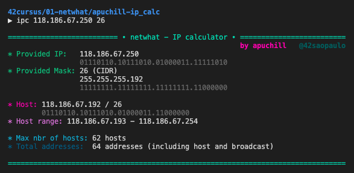
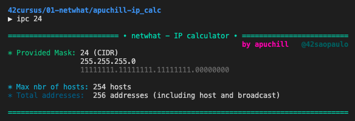
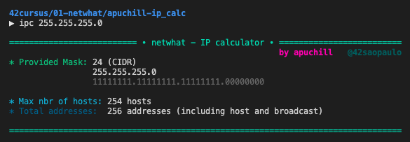

# IP Calculator

Program to calculate information about IP addresses and such, providing _just_ what is requested on the **netwhat test**.

### Printscreens







## How to use

### Installation

Simply [download](https://minhaskamal.github.io/DownGit/#/home?url=https://github.com/appinha/42cursus/tree/master/01-netwhat/apuchill-ip_calc) this folder and all its contents.

### Running

`cd` to the program's downloaded folder and run
```
sh ip.sh [IP address] [subnet mask or CIDR]
```
for information about the given **IP address**, or run
```
sh ip.sh [subnet mask or CIDR]
```
for information about the given **subnet mask/CIDR**.

### Tips

Set an **alias** for running the program, for instance:
```
alias ipc="cd ~/apuchill-ip_calc && sh ip.sh"
```
Then, it suffices to run `ipc [IP address] [subnet mask or CIDR]` or `ipc [subnet mask or CIDR]`.
